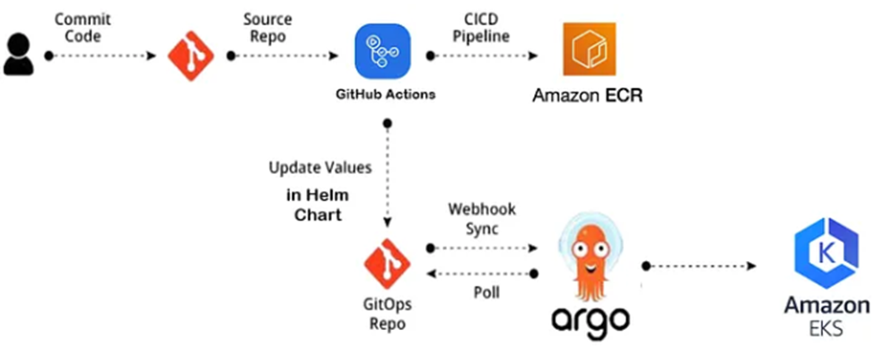

# final_project_upskill_23_devops

The workshop utilizes the following technologies and tools:

- GitHub Actions: CI/CD platform integrated with GitHub for automating workflows.
- AWS: Cloud services provider for hosting applications and managing infrastructure.
- EKS: Amazon Elastic Kubernetes Service for deploying, managing, and scaling containerized applications.
- ArgoCD: Declarative GitOps continuous delivery tool for Kubernetes.
- Terraform: Infrastructure as Code (IaC) tool for provisioning and managing AWS resources.
- Snyk: Continuously find and fix vulnerabilities
- ECR: Amazon Elastic Container Registry for securely storing and managing Docker images.
- Kubernetes Dashboard: Monitoring the k8s cluster
- Improvement: CPU and memory metrics to show up for pods

Steps:

1) Push to repo to start the Github Actions pipeline to check the code and create the AWS infrastructure using Terraform and push the images to ECR for api and web
2) Second pipeline will be triggered after the 1st one has completed successfully to install ArgoCD and Kuberenetes Dashboard to EKS
3) Third pipeline to start to Create Kubernetes ServiceAccount, ClusterRoleBinding and Secret
4) After Secret is created, we can execute the following command to get the token which saved in the Secret:

kubectl get secret admin-user -n kubernetes-dashboard -o jsonpath={".data.token"} | base64 -d

5) Accessing Dashboard
Now copy the token and paste it into the Enter token field on the login screen.

Click the Sign in button and that's it. You are now logged in as an admin.

You can enable access to the Dashboard using the kubectl command-line tool, by running the following command:

kubectl proxy

Kubectl will make Dashboard available at http://localhost:8001/api/v1/namespaces/kubernetes-dashboard/services/https:kubernetes-dashboard:/proxy/.

The UI can only be accessed from the machine where the command is executed. See kubectl proxy --help for more options.

